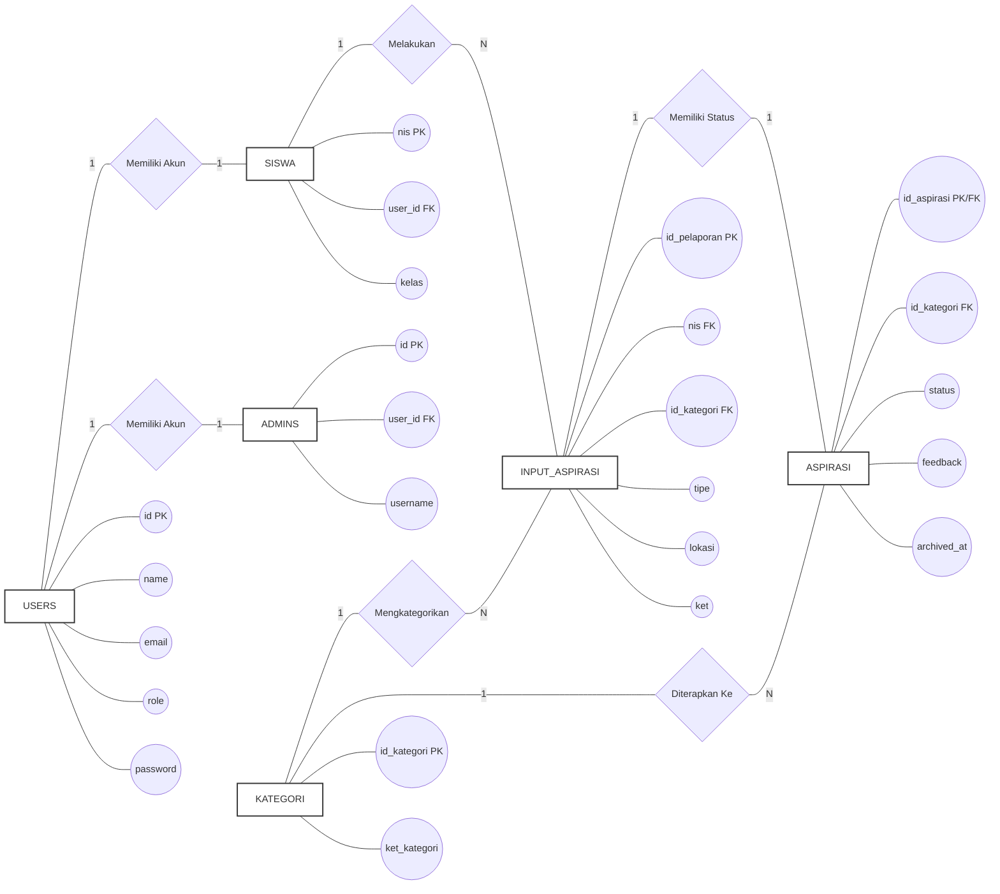

# Entity Relationship Diagram (ERD) - Repschool Palapa

```mermaid
graph LR
    %% Entitas (Kotak)
    USERS[USERS]
    SISWA[SISWA]
    ADMINS[ADMINS]
    KATEGORI[KATEGORI]
    INPUT[INPUT_ASPIRASI]
    STATUS[ASPIRASI]

    %% Relasi (Belah Ketupat)
    R1{Memiliki Akun}
    R2{Memiliki Akun}
    R3{Melakukan}
    R4{Mengkategorikan}
    R5{Memiliki Status}
    R6{Diterapkan Ke}

    %% Hubungan Many-to-One / One-to-One
    USERS ---|1| R1 ---|1| SISWA
    USERS ---|1| R2 ---|1| ADMINS
    SISWA ---|1| R3 ---|N| INPUT
    KATEGORI ---|1| R4 ---|N| INPUT
    INPUT ---|1| R5 ---|1| STATUS
    KATEGORI ---|1| R6 ---|N| STATUS

    %% Atribut USERS (Bulat)
    USERS --- U1((id PK))
    USERS --- U2((name))
    USERS --- U3((email))
    USERS --- U4((role))
    USERS --- U5((password))

    %% Atribut SISWA (Bulat)
    SISWA --- S1((nis PK))
    SISWA --- S2((user_id FK))
    SISWA --- S3((kelas))

    %% Atribut ADMINS (Bulat)
    ADMINS --- D1((id PK))
    ADMINS --- D2((user_id FK))
    ADMINS --- D3((username))

    %% Atribut KATEGORI (Bulat)
    KATEGORI --- K1((id_kategori PK))
    KATEGORI --- K2((ket_kategori))

    %% Atribut INPUT_ASPIRASI (Bulat)
    INPUT --- I1((id_pelaporan PK))
    INPUT --- I2((nis FK))
    INPUT --- I3((id_kategori FK))
    INPUT --- I4((tipe))
    INPUT --- I5((lokasi))
    INPUT --- I6((ket))

    %% Atribut ASPIRASI (Bulat)
    STATUS --- ST1((id_aspirasi PK/FK))
    STATUS --- ST2((id_kategori FK))
    STATUS --- ST3((status))
    STATUS --- ST4((feedback))
    STATUS --- ST5((archived_at))

    %% Styling
    style USERS fill:#fff,stroke:#333,stroke-width:2px
    style SISWA fill:#fff,stroke:#333,stroke-width:2px
    style ADMINS fill:#fff,stroke:#333,stroke-width:2px
    style KATEGORI fill:#fff,stroke:#333,stroke-width:2px
    style INPUT fill:#fff,stroke:#333,stroke-width:2px
    style STATUS fill:#fff,stroke:#333,stroke-width:2px
```
