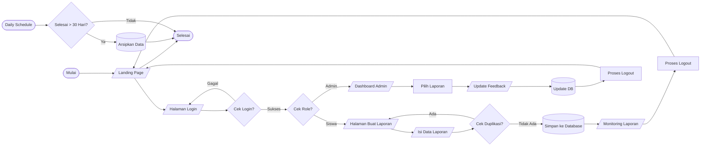

# Flowchart Sistem Pelaporan Sekolah (Repschool Palapa)

```mermaid
flowchart LR
    %% START & AUTH
    S1([Mulai]) --> S2[/Landing Page/]
    S2 --> S3[/Halaman Login/]
    S3 --> S4{Cek Login?}
    S4 -- Gagal --> S3
    S4 -- Sukses --> S5{Cek Role?}

    %% SISWA PATH
    S5 -- Siswa --> S6[/Halaman Buat Laporan/]
    S6 --> S7[/Isi Data Laporan/]
    S7 --> S8{Cek Duplikasi?}
    S8 -- Ada --> S6
    S8 -- Tidak Ada --> S9[(Simpan ke Database)]
    S9 --> S10[/Monitoring Laporan/]
    S10 --> S11[Proses Logout]

    %% ADMIN PATH
    S5 -- Admin --> A1[/Dashboard Admin/]
    A1 --> A2[Pilih Laporan]
    A2 --> A3[/Update Feedback/]
    A3 --> A4[(Update DB)]
    A4 --> A5[Proses Logout]

    %% LOGOUT & EXIT
    S11 --> S2
    A5 --> S2
    S2 --> E([Selesai])

    %% AUTOMATED SCHEDULER
    C1([Daily Schedule]) --> C2{Selesai > 30 Hari?}
    C2 -- Ya --> C3[(Arsipkan Data)]
    C3 --> E
    C2 -- Tidak --> E
```
